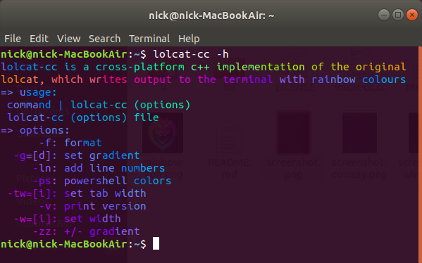
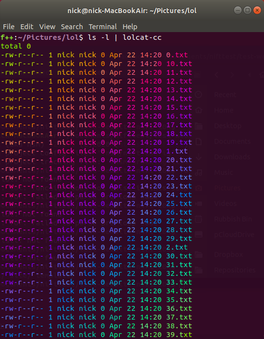
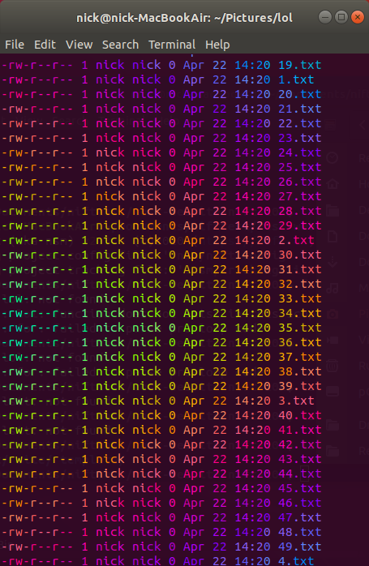
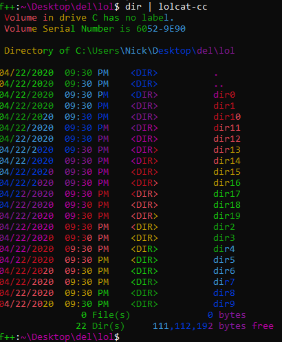

# 🌈 What?


## Usage 
```bash
$ lolcat-cc -h
lolcat-cc is a cross-platform c++ implementation of lolcat, 
which writes output to the terminal with rainbow colours
=> usage:
 command | lolcat-cc (options)
 lolcat-cc (options) file
=> options:
      -f: format
  -g=[d]: set gradient
     -ln: line numbers
     -ps: powershell colours
 -tw=[i]: set tab width
      -v: print version
  -w=[i]: set width
     -zz: +/- gradient
 ```

## Screenshots
### Ubuntu






### Windows


## Installation


### From Source

```bash
$ make && sudo make install
```

**Note:** On Windows you will need to move `lolcat-cc.exe` to a location searched by your path variable, for example try `C:\Windows\System32`.

## Why?

This `lolcat` clone was mostly to add limited rainbow support for Windows. It seems to be about twice as fast as `lolcat-c` on speed, both of which are an an entirely different league speed-wise compared to the original ruby version.

To benchmark them, an empty directory was filled with 100k files named `x.txt` where `x` goes from `1` to `100000`. From within the directory the following commands were run:

```bash
ls -l | time lolcat
ls -l | time lolcat-c
ls -l | time lolcat-cc -f
```

The results are in the following table:

| Tables           | lolcat(rb) | lolcat-c   | lolcat-cc  |
| ---------------- | ----------:| ----------:| ----------:|
| user             | 152.61     | 1.73       | 0.80       |
| system           | 17.05      | 0.35       | 0.35       |
| elapsed          | 2:50.36    | 0:04:20    | 0:03.39    |
| CPU              | 99%        | 48%        | 26%        |
| max resident     | 10228      | 19232      | 3396       |
| inputs           | 144        | 0          | 0          |
| major pagefaults | 1          | 1          | 0          |
| minor pagefaults | 1478       | 5348       | 131        |
| rb elapsed ratio | 1.0        | 0.0289     | 0.0162     |
| c elapsed ratio  | 34.5558    | 1.0        | 0.5598     |
| cc elapsed ratio | 61.7246    | 1.7862     | 1.0        |

(Read: ```lolcat-cc << lolcat-c << lolcat```)

## lolcat-cc output from shell 

The developer of `lolcat-cc` also created and develops [Nift](https://nift.dev) which has an in-built shell extension you can start with `nift sh` then you can turn on lolcat-cc output, including for tab completion suggestions, using [lolcat.on](https://nift.dev/docs/fns/lolcat.on.html).


